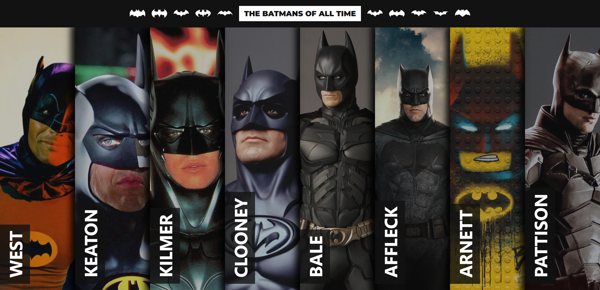
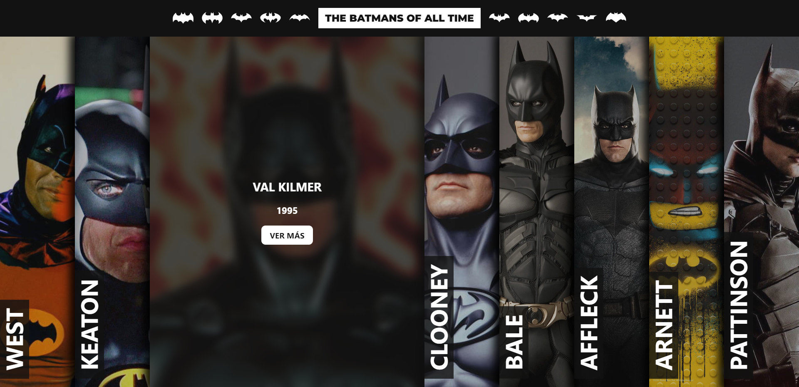
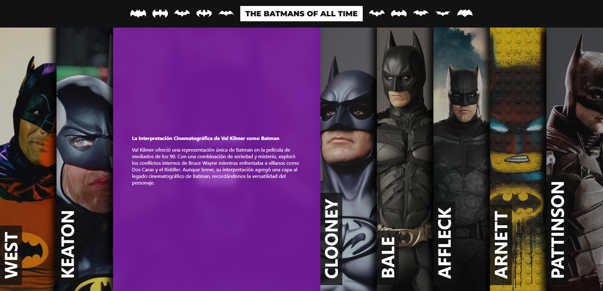

# Batman Actors App

Una pequeña aplicación web que muestra una lista de los actores que han interpretado a Batman en películas y series. Utiliza las tecnologías Vite y Astro para proporcionar un rendimiento rápido y una experiencia de usuario suave.

## Características

- Lista de actores que han interpretado a Batman.
- Detalles sobre cada actor, incluyendo su nombre y las películas/series en las que han actuado como Batman.

## Captura de Pantalla

## Tecnologías Utilizadas

- Vite: Un entorno de desarrollo ultrarrápido para aplicaciones web modernas.
- Astro: Un generador de sitios web estáticos que se siente como una aplicación web.

## Contribución

¡Contribuciones son bienvenidas! Si encuentras errores o deseas agregar nuevas características, siéntete libre de abrir un Issue o enviar un Pull Request.
